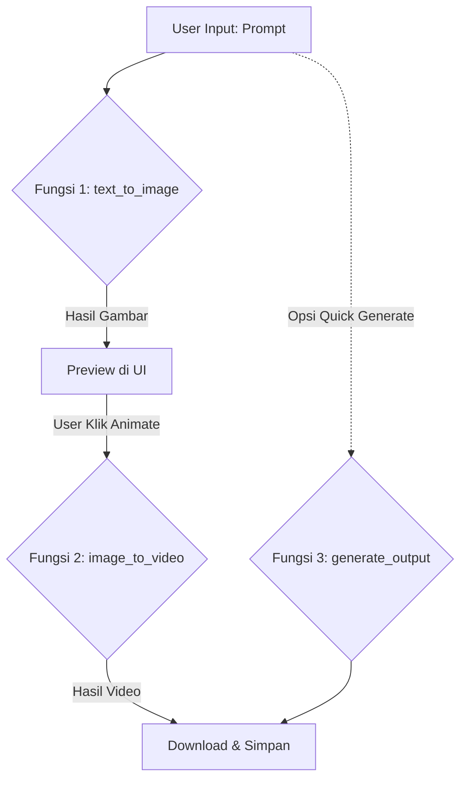

# 🧠 Dokumentasi Pipeline AI Generatif (VAX-STUDIO)

Dokumen ini menjelaskan alur kerja sistem AI generatif yang digunakan dalam proyek VAX-STUDIO, yang membagi proses pembuatan video menjadi beberapa fungsi modular.

---

## 🏗️ Arsitektur Sistem (Hybrid)
Sistem ini menggunakan arsitektur **Hybrid**, di mana:
1.  **Local Backend (PC Anda)**: Mengelola database, antarmuka pengguna (UI), dan mengatur urutan tugas (Orchestration).
2.  **Cloud Engine (Google Colab)**: Menjalankan model AI yang berat (Stable Diffusion & SVD) menggunakan GPU T4 15GB.

---

## 🛠️ Definisi Fungsi Utama

Berikut adalah penjelasan tiga fungsi utama yang membangun pipeline ini:

### 1. `def text_to_image`
**Peran**: Mengubah instruksi teks menjadi gambar statis.
- **Model**: Stable Diffusion v1.5.
- **Input**: `prompt` (deskripsi teks), `seed` (angka acak untuk variasi).
- **Output**: File gambar `.png` (Resolusi 1024x576).
- **Lokasi Eksekusi**: Google Colab (Engine).
- **Kegunaan**: Tahap awal untuk menentukan komposisi visual sebelum dianimasikan.

### 2. `def image_to_video`
**Peran**: Memberikan gerakan (animasi) pada gambar statis.
- **Model**: Stable Video Diffusion (SVD) XT.
- **Input**: `image` (hasil dari tahap 1 atau upload), `duration` (2s - 10s), `motion_bucket`.
- **Output**: File video `.mp4` (25 FPS).
- **Lokasi Eksekusi**: Google Colab (Engine).
- **Kegunaan**: Mengubah aset visual diam menjadi konten sinematik yang dinamis.

### 3. `def generate_output`
**Peran**: Pengendali utama (Orchestrator) yang menggabungkan seluruh pipeline.
- **Alur Kerja**: 
    1. Memanggil `text_to_image` untuk mendapatkan base visual.
    2. Mengambil hasil gambar tersebut dan langsung mengirimkannya ke `image_to_video`.
    3. Menyimpan hasil akhir video ke dalam database dan folder `outputs/`.
- **Lokasi Eksekusi**: Local Backend (`ai_service.py`).
- **Kegunaan**: Digunakan untuk fitur "Quick Generate" di mana pengguna hanya memasukkan prompt teks dan ingin langsung mendapatkan hasil video akhir.

---

## 🔄 Alur Kerja User (Workflow)

---
*Dokumentasi ini dibuat untuk memudahkan pemahaman struktur teknis VAX-STUDIO.*
