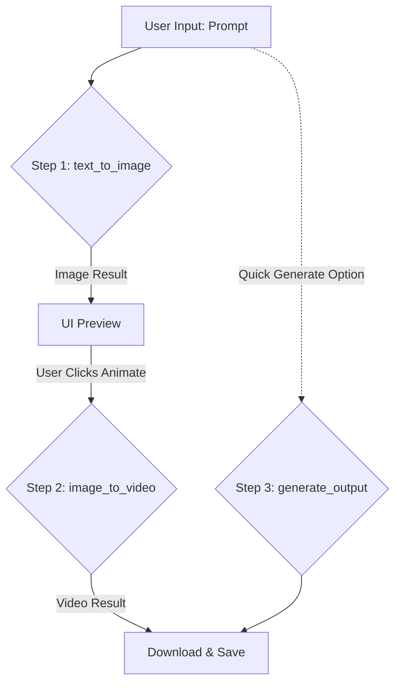

# 🧠 Generative AI Pipeline Documentation (VAX-STUDIO)

This document explains the generative AI workflow used in the VAX-STUDIO project, which divides the video creation process into modular functions.

---

## 🏗️ System Architecture (Hybrid)
This system utilizes a **Hybrid** architecture:
1.  **Local Backend (Your PC)**: Manages the database, user interface (UI), and task sequencing (Orchestration).
2.  **Cloud Engine (Google Colab)**: Runs heavy AI models (Stable Diffusion & SVD) using a Tesla T4 GPU (15GB).

---

## 🛠️ Key Function Definitions

Here are the three primary functions that build this pipeline:

### 1. `def text_to_image`
**Role**: Converts text instructions into a static image.
- **Model**: Stable Diffusion v1.5.
- **Input**: `prompt` (text description), `seed` (random number for variation).
- **Output**: `.png` image file (Resolution: 1024x576).
- **Execution Location**: Google Colab (Engine).
- **Purpose**: The initial stage to establish visual composition before animation.

### 2. `def image_to_video`
**Role**: Adds motion (animation) to a static image.
- **Model**: Stable Video Diffusion (SVD) XT.
- **Input**: `image` (result from Stage 1 or manual upload), `duration` (2s - 10s), `motion_bucket`.
- **Output**: `.mp4` video file (25 FPS).
- **Execution Location**: Google Colab (Engine).
- **Purpose**: Transforms static visual assets into dynamic, cinematic content.

### 3. `def generate_output`
**Role**: The main Orchestrator that combines the entire pipeline.
- **Workflow**: 
    1. Calls `text_to_image` to generate the base visual.
    2. Takes the resulting image and immediately sends it to `image_to_video`.
    3. Saves the final video to the database and the `outputs/` folder.
- **Execution Location**: Local Backend (`ai_service.py`).
- **Purpose**: Used for the "Quick Generate" feature where users enter a text prompt and receive a final video directly.

---

## 🔄 User Workflow

---
*This documentation is created to help understand the technical structure of VAX-STUDIO.*
