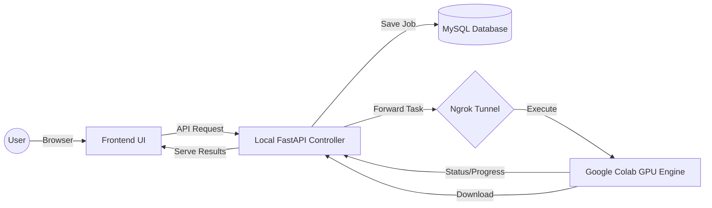

<<<<<<< Updated upstream
<<<<<<< HEAD
# AI Text-to-Video Generator (LTX-Video)
=======
# 🎬 VAX-STUDIO: Hybrid AI Video Generation Pipeline
>>>>>>> Stashed changes

**VAX-STUDIO** is a high-performance, hybrid AI video generation system that combines a local **FastAPI MVC Controller** with a cloud-based **Google Colab GPU Engine**. It allows users to generate high-quality AI images and animate them into cinematic videos (up to 10 seconds) using cutting-edge models like Stable Diffusion and Stable Video Diffusion.

---

## ✨ Key Features

- **🚀 Split-Pipeline Architecture**: Separate Text-to-Image (T2I) and Image-to-Video (I2V) workflows for maximum creative control.
- **☁️ Cloud-Powered Rendering**: Offloads heavy GPU computations to Google Colab, keeping your local machine light and cool.
- **📊 Real-Time Progress Tracking**: Visual progress bars show generation percentage in real-time.
- **⏱️ Dynamic Duration**: Control video length from 2s up to 10s directly from the UI.
- **🎨 Premium UI/UX**: Modern, glassmorphic frontend with dark mode and smooth animations.
- **🗄️ MVC Backend**: Structured FastAPI backend with MySQL database integration for job management.

---

## 🛠️ Technology Stack

| Component | Technology |
| :--- | :--- |
| **Local Backend** | Python, FastAPI, SQLAlchemy (Async), MySQL |
| **Cloud Engine** | Google Colab (Tesla T4 GPU), Diffusers, PyTorch |
| **Frontend** | HTML5, CSS3 (Vanilla), JavaScript (ES6+), FontAwesome |
| **Communication** | Ngrok (Secure Tunneling), Aiohttp |
| **AI Models** | Stable Diffusion v1.5, Stable Video Diffusion XT |

---

## 🏗️ Architecture Overview



---

## 🚀 Getting Started

### 1. Local Setup
1.  **Clone the Repository**:
    ```bash
    git clone https://github.com/RamadanMufian/VAX-TEAM-Dev.git
    cd VAX-TEAM-Dev
    ```
2.  **Environment Variables**:
    Edit the `.env` file and set your `HF_TOKEN`, `DB_URL`, and `NGROK_TOKEN`.
3.  **Run the Server**:
    Execute the startup script:
    ```bash
    start_server.bat
    ```

### 2. Google Colab Setup
1.  Open the provided notebook link in Google Colab.
2.  Paste the latest **VAX Engine v2.6** code into a cell.
3.  Run the cell and wait for the `🚀 ENGINE READY! URL: https://xxxx.ngrok-free.app` message.
4.  Copy that URL and update the `COLAB_API_URL` in your local `.env` file.

---

## 📖 Usage Guide

1.  **Step 1 (Generate Image)**: Enter a detailed prompt (e.g., *"Cinematic cat running in a meadow"*) and click **Generate Image**.
2.  **Preview**: Once the image appears, you can proceed to the next step or upload your own image.
3.  **Step 2 (Animate)**: Set your desired duration (up to 10s) and click **Animate This Image!**.
4.  **Download**: The video will appear in the UI and be saved automatically in the `outputs/` folder.

---

## 🔧 Troubleshooting

- **404 Not Found**: Ensure the Colab URL in `.env` matches the current Ngrok URL.
- **CUDA OOM**: If Colab crashes, reduce the video duration or restart the Colab kernel.
- **ImportError**: Ensure you are running the project within the `.venv` virtual environment.

---

## 📜 License
This project is developed for **VAX-TEAM** developers. All rights reserved.

<<<<<<< Updated upstream
# VRAM optimization flags
CPU_OFFLOAD = True
VAE_SLICING = True
VAE_TILING = True
USE_BFLOAT16 = True

# Generation settings
GUIDANCE_SCALE = 7.5
NUM_INFERENCE_STEPS = 30
=======
# VAX-TEAM-Dev
>>>>>>> upstream/main
=======
---
*Created with Ramadan Mufian*
>>>>>>> Stashed changes
