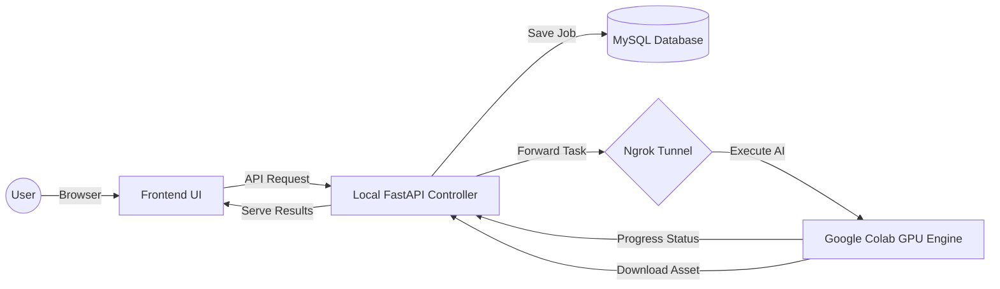

# 🎬 VAX STUDIO v1.3 — Hybrid AI Video Generation


**VAX STUDIO** is a high-performance, hybrid AI video generation system. It combines a local **FastAPI MVC Controller** with a cloud-based **Google Colab GPU Engine** to provide a seamless studio experience on local hardware.

---

## ✨ New in v1.3 (Latest Updates)
- **📊 Technical Metadata**: Results now display `Steps`, `CFG Scale`, `Seed`, and `Resolution`.
- **🎞️ Scrollable Gallery**: Enhanced "Recent Generations" with a modern horizontal scroll layout and technical tags.
- **🚀 Optimized Presets**: New resolution presets (16:9, 9:16, 3:2) optimized for T4 VRAM efficiency.
- **📁 Modular Architecture**: Moved Colab Engine logic to `app/model/` for better maintainability.

---

## 🏗️ System Architecture
The system utilizes a split-pipeline strategy to handle VRAM-intensive tasks:

1.  **Local Backend (PC)**:
    *   **Technology**: FastAPI, SQLAlchemy, MySQL.
    *   **Role**: Job management, Database persistence, UI rendering, and Ngrok orchestration.
2.  **Cloud Engine (Google Colab)**:
    *   **Technology**: PyTorch, Diffusers (SD 1.5, SVD-XT, CogVideoX-5B).
    *   **Role**: Heavy GPU lifting, Image synthesis, and Video rendering.



---

## 🛠️ Installation & Setup

### 1. Local Configuration
1.  **Clone & Install**:
    ```bash
    git clone https://github.com/RamadanMufian/VAX-TEAM-Dev.git
    cd VAX-TEAM-Dev
    setup.bat
    ```
2.  **Environment**: Update `.env` with your `NGROK_TOKEN` and `DB_URL`.
3.  **Start Server**:
    ```bash
    start_server.bat
    ```

### 2. Google Colab Setup
1.  Open the provided notebook link in Google Colab.
2.  Paste the latest **VAX Engine v3.4** code (from `app/model/setup_environment.py`) into a cell.
3.  Run the cell and wait for the `🚀 ENGINE READY! URL: https://xxxx.ngrok-free.app` message.
4.  Copy that URL and update the `COLAB_API_URL` in your local `.env` file.

---

## 📖 Usage Guide

1.  **Step 1 (Generate Image)**: Enter a detailed prompt (e.g., *"Cinematic cat running in a meadow"*) and click **Generate Image**.
2.  **Preview**: Once the image appears, you can proceed to the next step or upload your own image.
3.  **Step 2 (Animate)**: Set your desired duration (up to 10s) and click **Animate This Image!**.
4.  **Download**: The video will appear in the UI and be saved automatically in the `outputs/` folder.

---

## 🔧 Troubleshooting

- **404 Not Found**: Ensure the Colab URL in `.env` matches the current Ngrok URL.
- **CUDA OOM**: If Colab crashes, reduce the video duration or restart the Colab kernel.
- **ImportError**: Ensure you are running the project within the `.venv` virtual environment.

---

## 📜 License
This project is developed for **VAX-TEAM** developers. All rights reserved.
