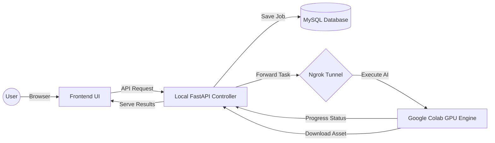

# 🎬 VAX STUDIO v3.4 — Hybrid AI Video Generation


**VAX STUDIO** is a high-performance, hybrid AI video generation system. It combines a local **FastAPI MVC Controller** with a cloud-based **Google Colab GPU Engine** to provide a seamless studio experience on local hardware.

---

## ✨ New in v3.4 (Latest Updates)
- **📊 Technical Metadata**: Results now display `Steps`, `CFG Scale`, `Seed`, and `Resolution`.
- **🎞️ Scrollable Gallery**: Enhanced "Recent Generations" with a modern horizontal scroll layout and technical tags.
- **🚀 Optimized Presets**: New resolution presets (16:9, 9:16, 3:2) optimized for T4 VRAM efficiency.
- **📁 Modular Architecture**: Moved Colab Engine logic to `app/model/` for better maintainability.

---

## 🏗️ System Architecture
The system utilizes a split-pipeline strategy to handle VRAM-intensive tasks:

1.  **Local Backend (PC)**:
    *   **Technology**: FastAPI, SQLAlchemy, MySQL.
    *   **Role**: Job management, Database persistence, UI rendering, and Ngrok orchestration.
2.  **Cloud Engine (Google Colab)**:
    *   **Technology**: PyTorch, Diffusers (SD 1.5, SVD-XT, CogVideoX-5B).
    *   **Role**: Heavy GPU lifting, Image synthesis, and Video rendering.



---

## 🛠️ Installation & Setup

### 1. Local Configuration
1.  **Clone & Install**:
    ```bash
    git clone https://github.com/RamadanMufian/VAX-TEAM-Dev.git
    cd VAX-TEAM-Dev
    setup.bat
    ```
2.  **Environment**: Update `.env` with your `NGROK_TOKEN` and `DB_URL`.
3.  **Start Server**:
    ```bash
    start_server.bat
    ```

### 2. Colab Engine Setup
1.  Open the VAX Engine script in Google Colab.
2.  Run the initialization cell and copy the generated Ngrok URL.
3.  Update `COLAB_API_URL` in your local `.env`.

---

## 📖 Generative Pipeline

### Stage 1: Text to Image (T2I)
*   **Model**: Stable Diffusion v1.5.
*   **Input**: Prompt, Negative Prompt, Resolution, CFG Scale, Steps.
*   **Output**: High-quality PNG asset.

### Stage 2: Image to Video (I2V)
*   **Model**: SVD-XT or CogVideoX-5B.
*   **Input**: Source Image, Motion Bucket (SVD), Video Prompt (Cog), Duration.
*   **Output**: Cinematic MP4 video with optional audio muxing.

---

## 📜 Credits & License
Developed by **VAX TEAM**. 
Lead Developer: **Ramadan Mufian**

---
*Created with ❤️ for the VAX AI Community*
